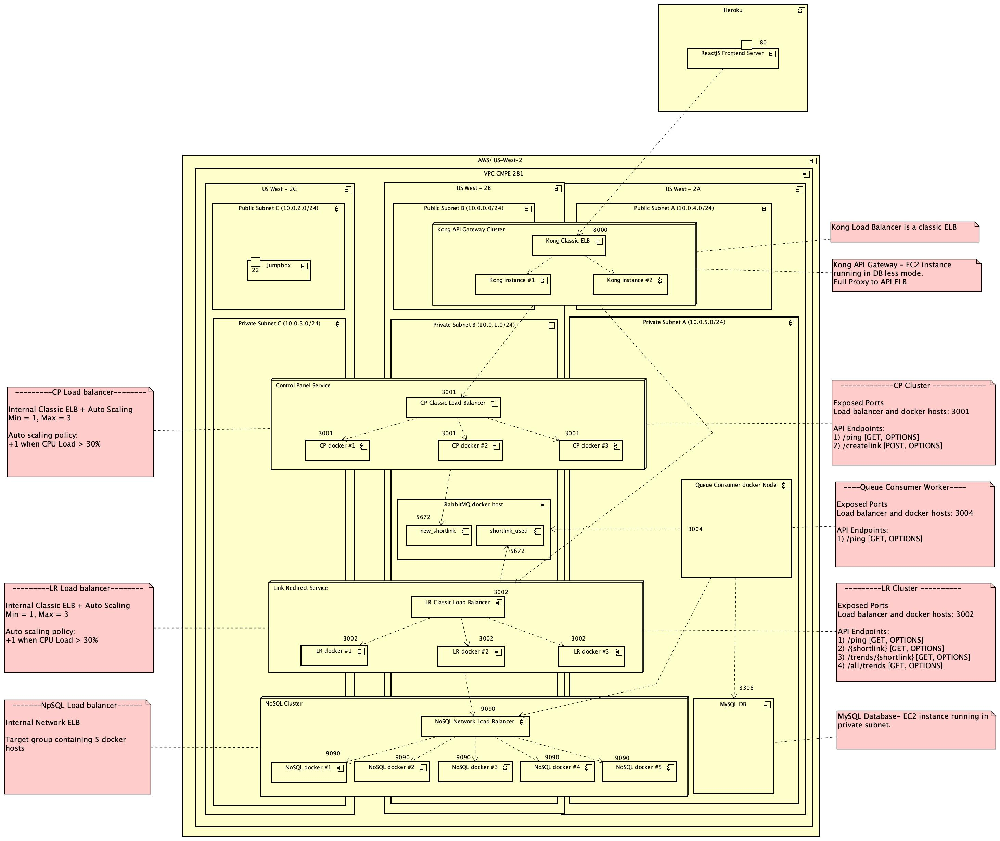
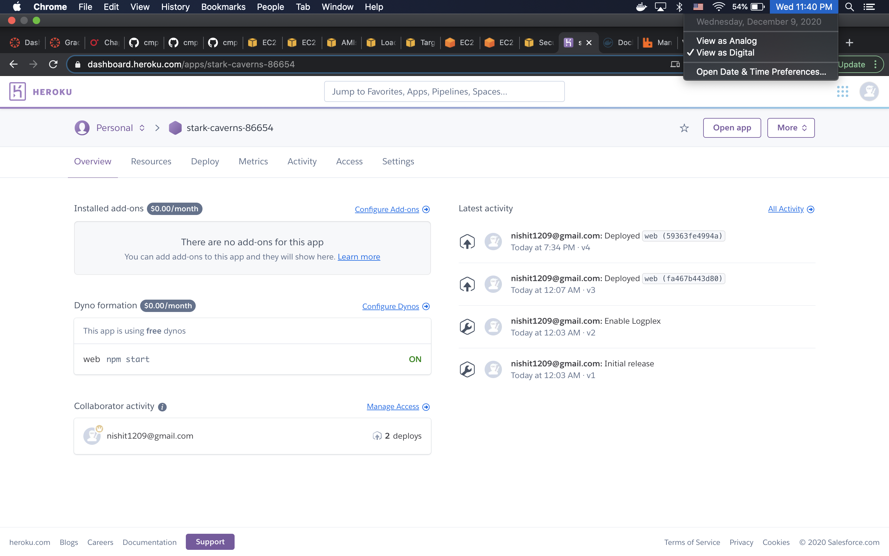
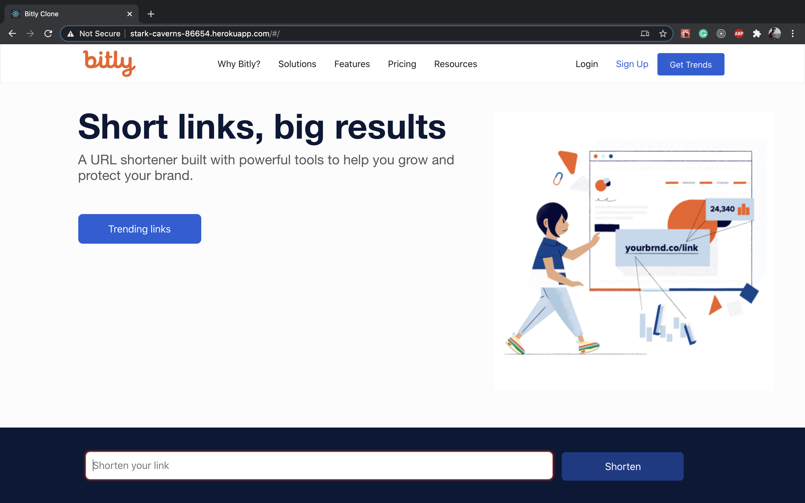
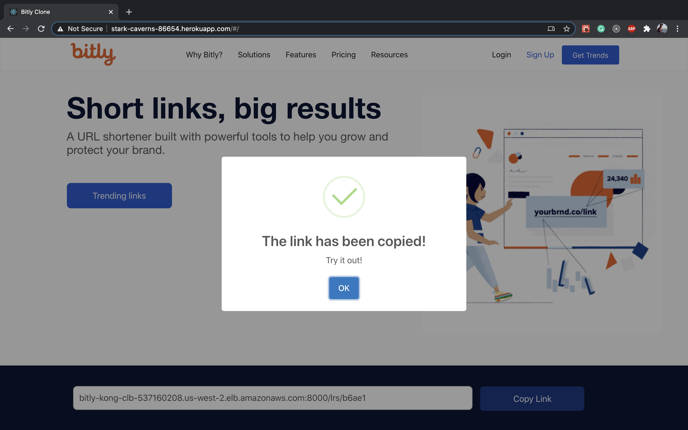
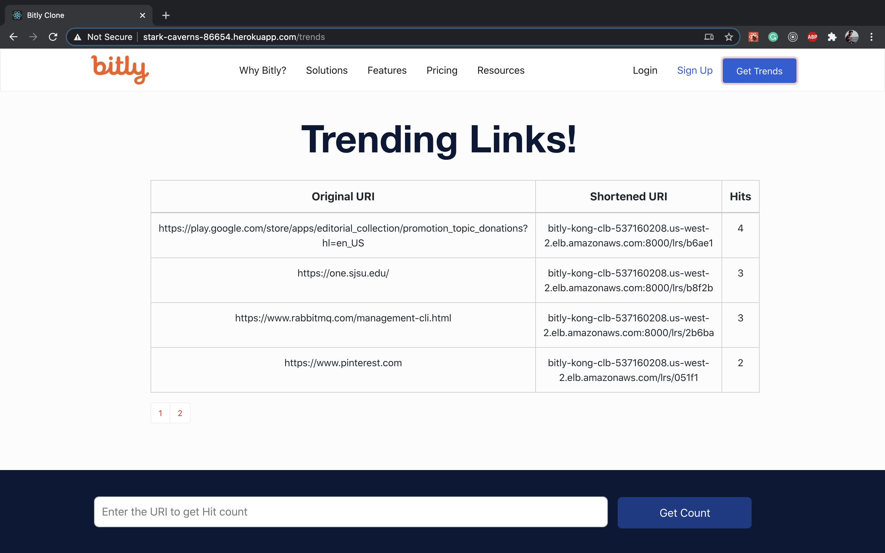
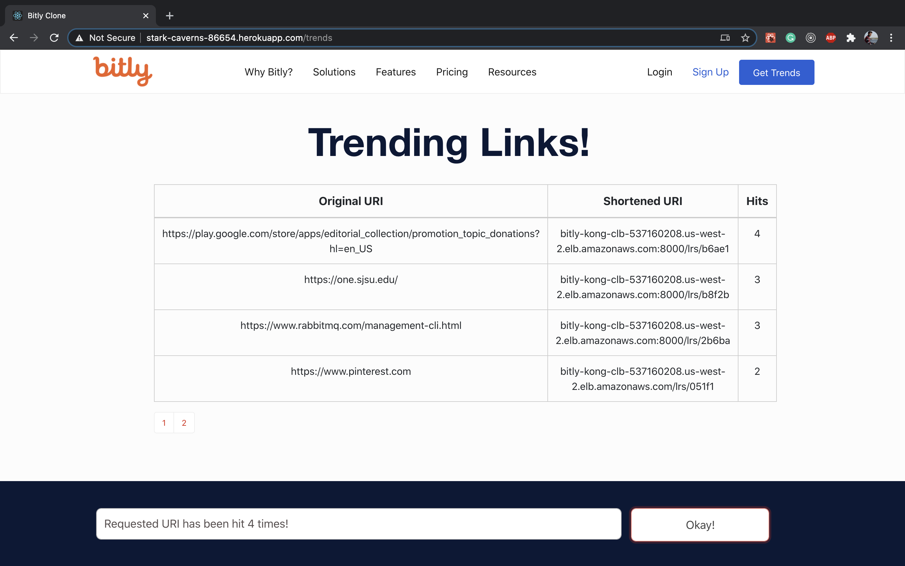

# Project Title: Bitly Clone

### For this project the Golang Backend has been deployed on AWS (Main) and the ReactJS Frontend is deployed on Heroku (Extra Credit)

Developed By: [Nishit Doshi](https://www.linkedin.com/in/nishit--doshi/) - 014542086

Application URI: <a href="http://stark-caverns-86654.herokuapp.com/" target="_blank">http://stark-caverns-86654.herokuapp.com/</a>

Youtube video link: <a href="https://youtu.be/oGKO2hAxPWE" target="_blank">https://youtu.be/oGKO2hAxPWE</a>

## Project Summary

The project implements a prototype of Bitly application. Bitly is a popular website that shortens the long URLs very easily and in very minimalistic way.

Project Features

1. Create a short link
2. Link redirect using short link
3. Get statistics of a particular short link
4. Get all shortened URLs
5. Get Statistics of all shortened URLs

## Project Architecture

Below is the high level architecture of my implementation of Bitly application. I have taken reference from the [Practice of Cloud System Administration](https://learning.oreilly.com/library/view/practice-of-cloud/9780133478549/ch04.html) book.



Description of each component of this architecture is given in the following sections.

### CQRS Architecture

The Command and Query Responsibility Segregation (CQRS) pattern separates read and update operations for a data store. Implementing CQRS in the application can maximize its performance, scalability, and security. The flexibility created by migrating to CQRS allows a system to better evolve over time and prevents update commands from causing merge conflicts at the domain level.

### How I have followed CQRS architecture in my application

In my application I follow Microservice architecture. There are separate services created to create or update details in the database and there is a different service available to query data from the database. In my architecture design, CP server (control panel) is used to create entries in the database. All the read requests from the database are performed on the link redirect servers.

### Event Sourcing

Some implementations of CQRS use the Event Sourcing pattern. With this pattern, application state is stored as a sequence of events. Each event represents a set of changes to the data. The current state is constructed by replaying the events. In a CQRS context, one benefit of Event Sourcing is that the same events can be used to notify other components — in particular, to notify the read model

### How I have implemented event sourcing in my application

I've used RabbitMQ as message bus to handle requests from the CP and Link Redirect servers. Whenever any event occurs at these servers, they notify the queue by sending the messages. There is queue consumer worker, who has subscribed to this channel. So whenever the queue recieves any new messages, its subscriber - Queue consumer worker gets notified. This worker further processes the messages and updates the databases.

Reference : [Microsoft Docs](https://docs.microsoft.com/en-us/azure/architecture/patterns/cqrs)

### Different components of my application

I'll take the bottom-up approach to give description of each components (shown in the architecture diagram).

### Backend

The backend of my application is developed in `Golang`. I've created `REST APIs` to interact with the frontend. I've also taken advantage of `concurrency` mechanism provided by Golang in the implementation of Queue Consumer. My backend has been deployed in AWS.

- **MySQL Database**
  <br>
  MySQL database is a persistent data storage of my application. All information about each link is available in it. My MySQL database is an ec2 instance running in the private subnet.

- **NoSQL Database (Cache)**
  <br>
  I'm using NoSQL database for the caching purpose. Link redirect server fetches details from the NoSQL database to redirect the user to the original URL. I've used my own implementation of NoSQL database. There are total 5 nodes running for the replication purpose. There is a network ELB running on top to distribute the requests.

- **CP Server**
  <br>
  CP server is where the new short link creation request comes. It generates the messages and forwards the new link creation message to the RabbitMQ. It consists 1 to 3 autoscaled docker hosts under the classic ELB.

- **LR Server**
  <br>
  LR server is used to query the database. It interacts with both MySQL and NoSQL databases to provide responses. where the new link redirect request comes, It generates the messages and forwards the new link hit message to the RabbitMQ. It consists 1 to 3 autoscaled docker hosts under the classic ELB.

- **RabbitMQ**
  <br>
  RabbitMQ is a docker host. It is connected with CP and LR servers and the Queue Consumer Worker is its subscriber. It consists of two queues:

  1. new_shortlink - to create new short link entries in the database
  2. shortlinks_used - To maintain the hit count

- **Queue Consumer Worker**
  <br>
  This worker has subscribed to the two queues. So whenever it gets the notification about new entries in the queue, it consumes the messages and based on the processing logic, updates the databases.

- **Kong API Gateway**
  <br>
  Kong API Gateway is an EC2 instance running in DB less mode. It provides full Proxy to API ELBs.

- **Jumpbox**
  <br>
  Jumpbox is used to interact with the private components of the AWS architecture.

### Frontend

The frontend of my application has been created using ReactJS framework. The deployment of frontend is done on Heroku.

- **ReactJS Framework**
  <br>
  React is a modern day javascript based light weight framework. React makes it painless to create interactive UIs.
  Link to [get started](https://reactjs.org/)

- **Pagination**
  <br>
  I have provided pagination functionality on the trending links page for the ease of use. I have created my own pagination component for this feature.

- **Auto Copy Button**
  <br>
  When the short link gets generated, the user can easily copy it by just clicking the button. I have used javascript in-built functions and react state management for this feature. The video demo covers the working of this feature.

- **Heroku**
  <br>
  My frontend has been deployed on Heroku. I've used heroku container registry service to deploy my docker container on heroku cloud. The steps of deployment are provided [here](https://github.com/nishitsjsu/Bitly-Clone/blob/main/heroku/heroku-deployment.md)
  <br>
  <br>

  

### Some screenshots of frontend

1. Home page
   <br>
   <br>
   

2. Create Link
   <br>
   <br>
   

3. All Trends
   <br>
   <br>
   

4. Link Trends
   <br>
   <br>
   

## API Documentation

Backend URI: http://bitly-kong-clb-537160208.us-west-2.elb.amazonaws.com:8000

## CP Server

### Health Check

```
endpoint: /cps/ping
--request GET
==> status: 200
    response: '{"Test": "Create link server alive!"}'
```

### Create Short Link

```
endpoint: /cps/createlink
--request POST
--data '{"uri":"https://one.sjsu.edu/"}'
==> status: 200
    response: '{"ShortLink": "bitly-kong-clb-537160208.us-west-2.elb.amazonaws.com:8000/lrs/b8f2b",
    "Uri": "https://one.sjsu.edu/",
    "Count": 0}'
```

## LR Server

### Health Check

```
endpoint: /cps/ping
--request GET
==> status: 200
    response: '{"Test": "Link Redirect server alive!"}'
```

### Link Redirect

```
endpoint: /lrs/{shortlink}
--request GET
==> status: 200
    response: HTML page
```

### Get Trends of a particular shortlink

```
endpoint: /lrs/trends/{shortlink}
--request GET
==> status: 200
    response: '{"Id": 0,
    "ShortLink": "bitly-kong-clb-537160208.us-west-2.elb.amazonaws.com:8000/lrs/b8f2b",
    "Uri": "https://one.sjsu.edu/",
    "Count": 0}'
```

### Get Trends of all links

```
endpoint: /all/trends
--request GET
==> status: 200
    response: '{[
    {
        "Id": 1,
        "ShortLink": "bitly-kong-clb-537160208.us-west-2.elb.amazonaws.com/lrs/051f1",
        "Uri": "https://www.pinterest.com",
        "Count": 2
    },
    {
        "Id": 2,
        "ShortLink": "bitly-kong-clb-537160208.us-west-2.elb.amazonaws.com/lrs/94b6b",
        "Uri": "https://www.uber.com",
        "Count": 2
    },
    {
        "Id": 3,
        "ShortLink": "bitly-kong-clb-537160208.us-west-2.elb.amazonaws.com/lrs/44b35",
        "Uri": "https://grasshopper.app/?utm_source=HPP&utm_medium=Owned&utm_campaign=gh_hpp",
        "Count": 2
    },
    {
        "Id": 4,
        "ShortLink": "bitly-kong-clb-537160208.us-west-2.elb.amazonaws.com:8000/lrs/26049",
        "Uri": "https://devcenter.heroku.com/articles/container-registry-and-runtime",
        "Count": 0
    },
    {
        "Id": 5,
        "ShortLink": "bitly-kong-clb-537160208.us-west-2.elb.amazonaws.com:8000/lrs/b8f2b",
        "Uri": "https://one.sjsu.edu/",
        "Count": 0
    }
]}'
```

## Project Planning

The Project planning has been maintained in a readme [here](https://github.com/nishitsjsu/Bitly-Clone/blob/main/project%20planning/project-planning.md) .

## Try the application

My application is available at the below URL:

http://stark-caverns-86654.herokuapp.com/
